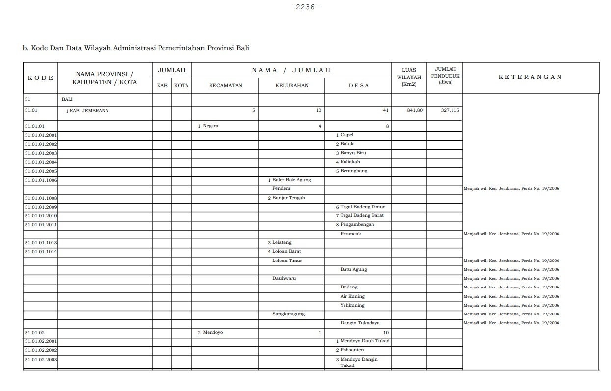
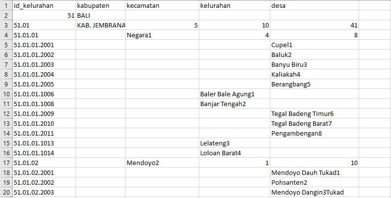
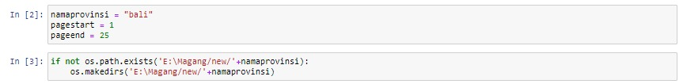
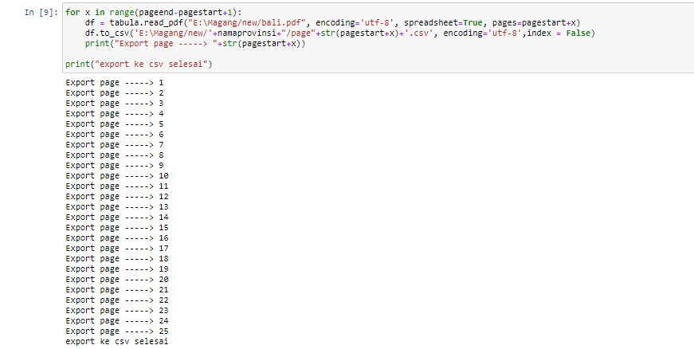
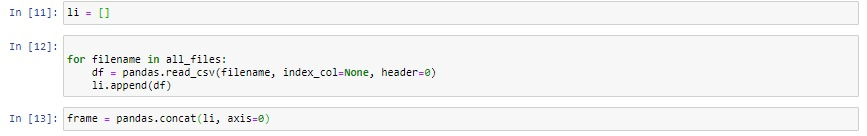
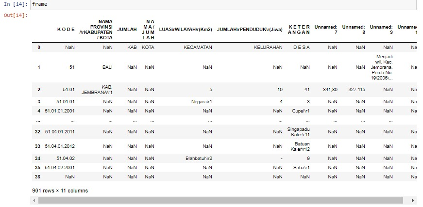
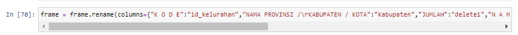
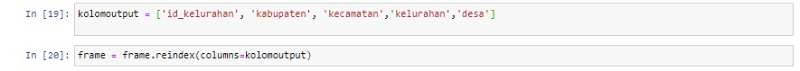
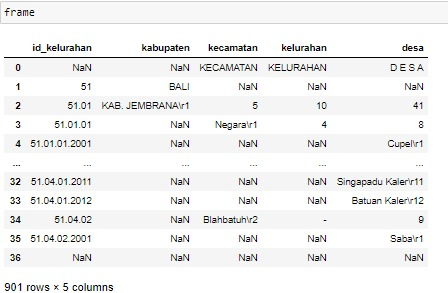
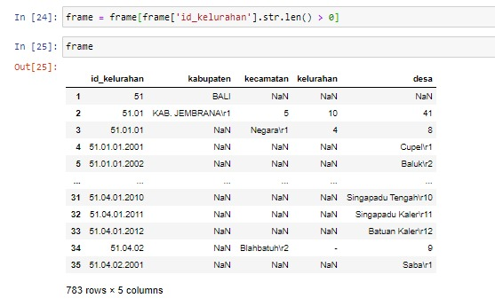

## Sharing-session

# Crawling-data-Data-Preparation


## Requirement
1. Menginstall [ Anaconda3 ](https://docs.anaconda.com/anaconda/install/windows/) / Jupyter notebook

2. [ File PDF Untuk Crawling  ](https://drive.google.com/file/d/1gcnAAHPgjZqSc20yw22m9U7Hejr2mpN0/view?usp=sharing)

3. Menginstal Library Berikut Pada Anaconda Prompt
   
 * **Pandas** 
 ```
 conda install -c anaconda pandas
 ```
  * **Numpy** 
 ```
 conda install -c anaconda numpy 
 ```
 * **Tabula** 
``` 
conda install -c conda-forge tabula-py 
```

## Daftar Isi
  - [1. Crawling From PDF](#1-Crawling-From-PDF)
  
  - [2. Cleaning and Formatting Data](#2-Cleaning-and-Formatting-Data)
  
## 1. Crawling From PDF
Pada Sharing Session kali ini kita akan membahas tentan Crawling Data dengan sumber table dari pdf 
kedalam Format Csv
* **Input**

* **Output**


### Tahapan Eksekusi
### Library
   ```python3 
   import pandas
   import tabula
   import glob
   import os
   
   ```
 Pada Sharing Session kali ini kita menggunakan beberapa Library python yaitu 
 
* `Pandas` Untuk Penanganan Data
* `tabula` Untuk Crawling Data dari pdf
* `glob`   Untuk Mengambil File dari Direktori
* `os`     Untuk Menjalankan Perintah operating system pada python

### Source Code

Pada tahapan pertama yang dilakukan adalah inisiasi variabel page yang ingin dicetak dan
pembuatan direktori untuk menyimpan hasil output



Setelah Direktori dibuat tahap selanjutnya adalah melakukan convert dari pdf ke csv page per page
pada case ini output dari file csv per page disimpan didalam direktori `E:\Magang/new/bali/`




File Csv Per Page akan tersimpan di direktori `E:\Magang/new/bali/` ,Maka Langkah Selanjutnya adalah menggabungkan
file csv tersebut menjadi 1.
Disini kita perlu menyimpan terlebih dahulu semua nama csv yang ada dalam direketori dengan menggunakan library *glob*


Selanjutnya kita membuka file csv tersebut dan menyimpannya dalam sebuah array.
yang lalu akan disatukan menggunakan library pada pandas yaitu concat


Berikut adalah output table yang disatukan


Setelah terconvert nama column akan berantakan dan tidak urut,
maka kira merename dan menata ulang column menggunakan pandas




Ouput akan seperti berikut



Karena Masih ada id_kelurahan yang masih null,
maka kita perlu melakukan filter pada menggunakan pandas


Dan selanjutnya adalah tahap terakhir yaitu export ke csv


output akan seperti berikut


## 2. Cleansing and Formatting Data
Seringkali raw data yang diterima seorang Data Scientist tidak dapat langsung digunakan untuk modelling, untuk tipe data seperti ini maka diperlukan tahap pre-processing; salah satunya adalah data cleansing.
Berikut ini contoh cleansing dan formating data Pulau Kalimantan yang terdiri dari (Kalimantan Barat, Kalimantan Tengah, Kalimantan Selatan, Kalimantan Timur, dan Kalimantan Utara)
Berikut ini untuk script cleansing menggunakan python :

```
import pandas as pd,numpy as np,glob
```
   Keterangan :

   * ```import pandas as pd ```:  mengimport library pandas as pd terlebih dahulu (pandas untuk membersihkan data mentah ke bentuk data yang dapat diolah)
   * ```import numpy as np ```: mengimport library numpy as pd terlebih dahulu (numpy untuk mengubah python ke pemodelan ilmiah)
   * ```import glob``` : mengimport library glob terlebih dahulu (glob untuk mengambil file dari direktory)

```provinsi = "Bali"```
   Untuk menyimpan nama kolom pada provinsi 

```df = pd.read_csv("E:\Magang/new/Bali.csv",sep=',')```
   Keterangan :
   
   * ```pd.read_csv``` : untuk membaca file dengan format CSV dan mengkonversinya menjadi pandas Dataframe
   * ```sep='``` : parameter sep=',' sesuai separator pada file
   
```df.head(n)```
   Untuk mendapatkan n baris data teratas; jika tidak diisi n maka secara random n=6 
   
```df['kabupaten'] = df['kabupaten'].fillna(method='ffill')
   df['kecamatan'] = df['kecamatan'].fillna(method='ffill')
   ```
 Keterangan :
   * fillna untuk mengganti setiap NaN dengan nilai non -NaN pertama pada kolom yang sama di atasnya.
   
 ```df = df[df['id_kelurahan'].str.len() >10]```
   Keterangan :
   * ```str.len()``` untuk mendapatkan jumlah panjang sebuah string
   
 ```df['desa'] = df['desa'].str.replace('\r\d+', '')
df['kelurahan'] = df['kelurahan'].str.replace('\r\d+', '')
df['kecamatan'] = df['kecamatan'].str.replace('\r\d+', '')
df['kabupaten'] = df['kabupaten'].str.replace('\r\d+', '')
   ```
   Keterangan :
   * ```str.replace ('\r\d+', '')``` untuk mengubah "\r" setelah integer (dimana \d+ adalah regex untuk nomor integer)
   
 ```df['provinsi'] = provinsi```
   untuk memasukkan kolom provinsi ke dalam variable
   
 ```df['keterangan'] = np.where(df['kelurahan'].isnull(), 'desa', 'kelurahan')```
   Keterangan :
   * ```np.where``` adalah  


