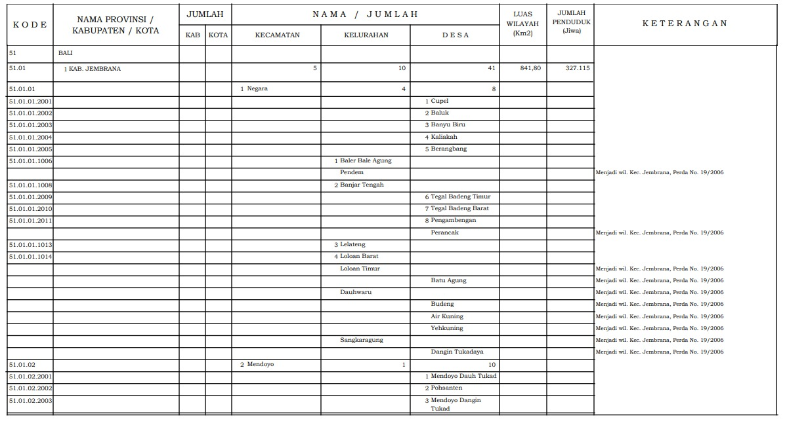

## Sharing-session

# Crawling-data-Data-Preparation


## Requirement
1. Menginstall [ Anaconda3 ](https://docs.anaconda.com/anaconda/install/windows/) / Jupyter notebook

2. [ File PDF Untuk Crawling  ](https://drive.google.com/file/d/1gcnAAHPgjZqSc20yw22m9U7Hejr2mpN0/view?usp=sharing)

3. Menginstal Library Berikut Pada Anaconda Prompt
   
 * **Pandas** 
 ```
 conda install -c anaconda pandas
 ```
  * **Numpy** 
 ```
 conda install -c anaconda numpy 
 ```
 * **Tabula** 
``` 
conda install -c conda-forge tabula-py 
```

## Daftar Isi
  - [1. Crawling From PDF](#1-Crawling-From-PDF)
  
  - [2. Cleaning and Formatting Data](#2-Cleaning-and-Formatting-Data)
  
## 1. Crawling From PDF
Pada Sharing Session kali ini kita akan membahas tentan Crawling Data dengan sumber table dari pdf 
kedalam Format Csv
* Input

* Output

### Library
   ```python3 
   import pandas
   import tabula
   import glob
   import os
   
   ```
 Pada Sharing Session kali ini kita menggunan beberapa Library python yaitu 
 
* `Pandas` Untuk Penanganan Data
* `tabula` Untuk Crawling Data dari pdf
* `glob`   Untuk Mengambil File dari Direktori
* `os`     Untuk Menjalankan Perintah operating system pada python

## 2. Cleaning and Formatting Data
